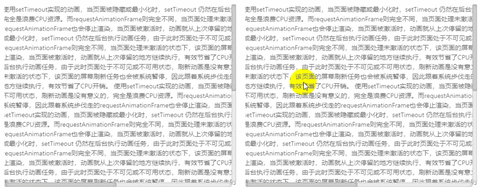

# 基于 React 的滚动条方案


看到标题，你一定要问：

> 为什么还要再造一个轮子？`IScroll`不好用吗？那还有 `Better-Scroll`啊？

这两个库都不错，自己平时也用，之所以要做，原因只有两个：

1. 不符合 React 的范式：`ui = f(state)`

这两个库都是跨平台的，都是直接操作 `dom` 的，跨平台不是不好，肯定是好，但是在 React 的世界，要处理状态的同步，通常都是通过状态或属性来控制，虽然可以用个 React 包裹上面两个库，提供 React 版本，但是总是觉得不那么完美。

2. 产品的无理需求

团队提供的是PC端面向B端的商业产品，需要有很好的交互体验

产品说：系统的滚动条能不能改改样式？

我说：可以改，Chrome 可以改，但是 FireFox 等改不了，

产品说：能鼠标 Hover 的时候变大？

我说：我试试，Edeg 本来身就支持，Chrome 努努力也行，其他的好像不行

产品说：你看这里表格里面的滚动条，能不能拿到浏览器边上来

我说：我靠，这个表格是在内部啊，离浏览器边上隔着几座山，他是个单独的组件

产品说：我怎么拖拽页面，就让页面滚动，不用拖滚动条

我说：移动端触摸屏可以，PC 上你可以用触摸板

产品说：我的触摸板咋不起作用

我说：Mac 上可以，你这 TinkPad 触摸板好像得安装个驱动，你可以用鼠标滚轮

好了，综上，我们的产品需求你明白了吗？下面我先写一条自己的感悟：

> 如果你想成长，那么在面对产品经理的无理需求的时候，你要拒绝，就要做到问心无愧的拒绝

事实上，拒绝很容易，总是有理由的，成本也是最低的，但是内心总是觉得，这个肯定可以实现，可惜时间成本有点高，bug 这么多，改不过来，要实现这个，怎么不得一两天？一两天都未必够，说不准有什么问题

当然，我还是是拒绝了产品，集中精力改阻断性的 bug，然后，趁着周末，好好构思了下这个滚动条该怎么做，要是答应了产品，最后做不出来，就糗大了，做出来，算是给产品的惊喜，虽然他意识不到这个有多坑……

## 设计目标

1. 贴近原生，易用，易于从默认滚动条切换到新的滚动条

原生写法：

```jsx
<div className="container"
    style={{
        width: 500,
        height: 400,
        overflow:'auto'
    }}
    onScroll={onScroll}
>
    <div className="content" ref="content" style={{
        width: 1000,
        height: 800,
    }}>
        {content}
    </div>
</div>
```
只需要修改容器的标签，替换后：

```jsx
<Scroll className="container"
    style={{
        width: 500,
        height: 400,
        overflow:'auto'
    }}
    onScroll={onScroll}
>
    <div className="content" ref="content" style={{
        width: 1000,
        height: 800,
    }}>
        {content}
    </div>
</Scroll>
```

2. `onScroll` 接口和原生保持一致，不影响原有业务逻辑
```js
export interface IScrollEvent {
    target: {
        scrollLeft: number;
        scrollTop: number;
    };
}
export interface IScrollProps{
    /**
     * 滚动条距离左侧的距离
     */
    scrollLeft?: number;
    /**
     * 滚动条距离顶部距离
     */
    scrollTop?: number;
    onScroll?: (e: IScrollEvent) => void;
}
```
3. 支持 `scrollLeft` 和 `scrollTop` 属性修改滚动条位置，同时对象实例也提供 如下属性，兼容原生 DOM API

```js
export interface IScroll {
    scrollLeft: number;
    scrollTop: number;
    /**
     * 滚动到指定位置
    */
    scrollTo: (left: number, top: number) => void;
    /**
     * 滚动相对距离
    */
    scrollBy: (left: number, top: number) => void;
    /**
     * 重新计算滚动区域
    */
    refresh: () => void;
}

```

## 面对的问题

1. 如何让元素移动

可以使用 `绝对定位` 或者 `transform` ,`transform` 是首选，因为可以支持 `gpu` 加速，处理滚动动画性能会好一些

2. 如何支持拖拽

当然是监听 `mousedown`，`mousemove`，`mouseup`，计算鼠标移动的方向，和相对距离，然后确定元素的位置，移动端要监听 `touchstart`, `touchmove`, `touchend`事件

3. 如何支持触摸板

查了一下，PC 触摸板可以出发 `onwheel` 事件，就是鼠标滚轮滚动事件，靠这个可以支持触摸板，我的 ThinkPad 也可以支持。

4. 如何做滚动动画

如果只是用滚动条，可以不用动画，但是拖拽的时候，要有个滚屏动画，比如CSS3里的 `ease-in` `ease-out`动画，可以用`setInterval` 或者 `requestAnimationFrame` api 来做，可以先做个匀减速直线运动，其他的动画再说

5. 如果支持 `ui = f(state)` 范式，频繁修改 state，重新渲染，是否有性能问题？

相比于直接修改 dom ，性能肯定是有折扣的，不过在接受的范围内

上面的问题基本都是可以解决，没有阻断性的问题，下面就是实现：

## 实现

### 拖拽移动

鼠标拖拽一般使用 `onMouseDown` `onMouseMove` `onMouseUp` 事件，大体流程如下：
1. `onMouseDown` 事件中记录鼠标初始位置 `pointStart` ，为 `document` 注册 `mousemove` 和 `mouseup` 事件
2. `onMouseMove` 事件中鼠标移动，记录鼠标当前位置 pointEnd，减去 `popointEnd` - `pointStart` 得到鼠标的偏移量，设置 `secrollLeft` ，页面滚动。
3. `onMouseUp` 事件中，获取鼠标的 `即时速度`，如果速度为 `0` ，那么终止移动，如果速度大于 `0`，执行滚动动画，移除 `document` 的 `mousemove` 和 `mouseup` 事件

> 这里没有给滚动区域的根节点加 `mousemove` 和 `mouseup` 事件，给 `document` 加鼠标的 `mousemove` 和 `mouseup` 事件，因为鼠标的移动区间可能会超过滚动区域，如果超过滚动区域这两个事件就不再执行了

### 即时速度 计算

鼠标抬起以后，需要知道移动的速度，然后以这个速度做减速运动，所以需要计算 `即时速度` ，这里不能用平均速度。

计算 `即时速度` 需要知道 `距离` 和 `时间`，鼠标点击以后，通过 `setInverval` 计时器，每 `100ms` 记录鼠标的的位置和时间戳，鼠标抬起以后，终止计算，获取当前位置和时间，和历史的位置和时间戳做差，得到最后 `100ms` 内的速度，计算如下：

```js
/**
 * 启动即时速度计算
 */
startCaclRealV = () => {
    const me = this;
    const t = _REAL_VELOCITY_TIMESPAN;
    const timer = setInterval(() => {
        if (!me.isDraging) {
            clearInterval(timer);
            return;
        }
        if (!me.lastPos) {
            me.lastTime = Date.now();
            me.lastPos = me.endPoint;
            return;
        }
        me.lastTime = Date.now();
        me.lastPos = me.endPoint;
    }, t);
    return {
        destroy() {
            clearInterval(timer);
        },
    }
}
/**
 * 计算即时速度
 */
caclRealV = () => {
    const me = this;
    if (!me.lastPos) {
        return {
            realXVelocity:0,
            realYVelocity:0
        }
    }
    const time = (Date.now() - me.lastTime) / 1000;
    const xdist = Math.abs(me.endPoint.x - me.lastPos.x);
    const ydist = Math.abs(me.endPoint.y - me.lastPos.y);
    return {
        realXVelocity:caclVelocity(xdist, time),
        realYVelocity:caclVelocity(ydist, time),
    }
}

```

### 滚动动画

鼠标抬起以后，以 `即时速度` 开始做减速运动，这里可以利用缓动函数计算位置，设置 `scrollLeft` ，我这里使用了匀减速运动，使用 `requestAnimationFrame` 执行动画循环，利用 `transform: translate3d(0,${indicateTop}px,0)`设置偏移，可以启动 pgu 加速,

代码参考：
```js
import { TDirection, TPoint } from './types'

/**
 * 动画执行函数
 * @param v 速度 像素/秒
 * @param a 减速度 像素/秒平方
 * @param onMove 回调函数，返回移动距离
 * @param onEnd 回调函数，终止动画
 */
export const animate = (v: number, a: number, onMove: (dist) => boolean, onEnd: () => void): { destroy: () => void } => {
    const t = 16;// ms
    const start = Date.now();
    return loopByFrame(t, () => {
        const time = (Date.now() - start) / 1000;
        if (time === 0) {
            return true;
        }
        const dist = move(v, a, time);
        if (dist === 0) {
            return false;
        }
        return onMove(dist);
    }, onEnd);
}

/**
 * 利用 requestAnimationFrame 执行动画循环
 * @param duration 动画时间间隔，使用 requestAnimationFrame 不需要设置
 * @param onMove 动画执行函数
 * @param onEnd 动画终止函数
 */
export const loopByFrame = (duration = 16, onMove = () => true, onEnd = () => void 0): { destroy: () => void } => {

    let animateFrame;
    function step(func, end = () => void 0) {
        if (!func) {
            end();
            return;
        }

        if (!func()) {
            destroy();
            end();
            return;
        }

        animateFrame = window.requestAnimationFrame(() => {
            step(func, end);
        });
    }
    function destroy() {
        if (animateFrame) {
            window.cancelAnimationFrame(animateFrame);
        }
    }

    step(onMove, onEnd);

    return {
        destroy,
    }
}

/**
 * 利用 setInterval 执行函数循环
 * @param duration 时间间隔
 * @param cb 回调函数
 * @param onEnd 终止函数
 */
export const loopByInterval = (duration = 16, cb = () => true, onEnd = () => void 0): { destroy: () => void } => {
    const timer = setInterval(() => {
        if (!cb()) {
            clearInterval(timer);
            onEnd();
        }
    }, duration);
    return {
        destroy() {
            clearInterval(timer);
            onEnd();
        },
    }
}

/**
 * 计算以速度 v ，减速度 a，运动 time 时间的距离
 * @param v 速度
 * @param a 减速度
 * @param time 时间
 */
export const move = (v: number, a: number, time: number) => {
    // 获取下一时刻速度，如果速度为 0 终止
    const nextV = caclNextVelocity(v, a, time);
    if (nextV <= 0) {
        return 0;
    }
    // 计算下一刻的距离
    const dist = caclDist(v, time, a);
    return dist;
}

/**
 * 计算滚动方向，暂时只支持横向滚动
 * @param start 起始点
 * @param end 终点
 */
export const caclDirection = (start: TPoint, end: TPoint): TDirection => {
    const xLen = (end.x - start.x);
    const yLen = (end.y - start.y);
    if (Math.abs(xLen) > Math.abs(yLen)) {
        return xLen > 0 ? 'right' : 'left';
    } else {
        return yLen > 0 ? 'bottom' : 'top';
    }
}

/**
 * 减速直线运动公式，计算距离
 * @param v 速度
 * @param t 时间 单位秒
 * @param a 加速度
 */
export const caclDist = (v: number, t: number, a: number) => {
    return v * t - (a * t * t) / 2;
}

/**
 * 计算速度
 * @param v0 初始速度
 * @param a 加速度
 * @param t 时间
 */
export const caclNextVelocity = (v0: number, a: number, t: number) => {
    return v0 - a * t;
}

/**
 * 计算速度
 * @param dist 距离 单位像素
 * @param time 时间 单位秒
 */
export const caclVelocity = (dist: number, time: number) => {
    if (time <= 0) {
        return 0;
    }
    return dist / time;
}

```
## 滚动条同步

碰到页面里需要多个区域滚动条同步到情况，可以使用这个模式，比如我们系统中，表头，表体，工具栏需要进行同步的情况

滚动条同步本来我们使用了系统自带的滚动条的 `scrollLeft` 属性进行同步，但是会很卡顿，现在使用了 `Scroll` 组件，利用 CSS3 的`transform`  来进行同步，效果好很多。

示例代码：
```jsx
import React,{Component} from 'react';

class Demo extends Component{
    constructor(props,context){
        super(props,context);
        const me=this;
        me.state={
            scrollLeft:0,
            scrollTop:0,
        }
    }
    onScroll=(e)=>{
        const me=this;
        me.setState({
            scrollLeft:e.target.scrollLeft,
            scrollTop:e.target.scrollTop
        });        
    }
    render(){
        const me=this;
        const {
            scrollLeft,
            scrollTop
        }=me.state;
        return (            
            <Scroll
                scrollLeft={scrollLeft} 
                scrollTop={scrollTop}
                className="container"
                style={{ width: 500, height: 400,}}
                onScroll={me.onScroll}
            >
                <div className="content" ref="content" 
                    style={{width: 1000,height: 800}}>
                    
                </div>
            </Scroll>      
             <Scroll
                scrollLeft={scrollLeft}
                scrollTop={scrollTop}
                className="container"
                style={{width: 500,height: 400,}}
                onScroll={me.onScroll}
            >
                <div className="content" ref="content" 
                    style={{width: 1000,height: 800,}}>
                    
                </div>
            </Scroll>            
        )
    }
}
```

## 效果展示





## 最后

本文尝试自行实现滚动条来解决 PC 端各个浏览器滚动条行为不一致的问题，兼容原生的 API，能做到无缝切换，整体实现难度中等，主要实现缓动动画上需要注意一些，对有些问题是不是有更好的办法？

1. `即时速度` 计算，是不是还有更好的方法？
2. 文中动画采用的是 匀减速直线运动 ，后续是不是可以提供丰富的动画满足需求？
3. 目前暂不支持移动端，后续是不是可以支持移动端？
